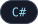
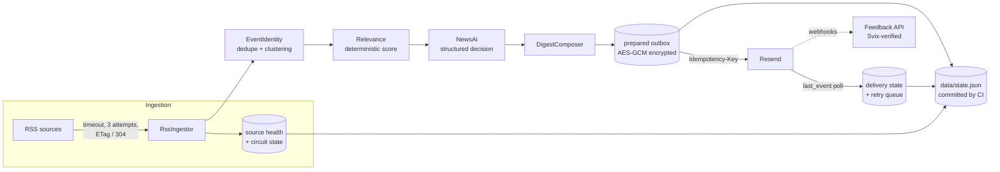

# Cosmic Digest

A daily .NET job that turns RSS feeds into a short, relevance-gated email brief, built to deliver exactly once when feeds and providers fail.

[](#status)




## What it does

- Pulls candidate stories from configured RSS sources with per-attempt timeouts, up to three attempts, and conditional requests (`ETag` / `Last-Modified`, `304 Not Modified`).
- Tracks per-source health and opens a circuit on a feed after repeated failures (default 3 failures, paused for 6 hours; both configurable).
- Normalizes URLs, strips tracking parameters, and groups related coverage from different publishers into one event without treating publisher count as corroboration.
- Scores events deterministically against a versioned briefing profile (priority, freshness, trust, novelty) before any model call.
- Sends a small candidate set to an OpenAI model for a structured `act` / `watch` / `learn` decision; falls back to ranked headlines if the model call fails.
- Suppresses the email entirely when nothing clears the materiality gate.
- Delivers through Resend with a content-derived idempotency key, then polls `last_event` so API acceptance and actual delivery state are recorded separately.
- Optional feedback service: signed, expiring feedback links and Svix-verified Resend webhooks.

## How it works

The repository name is `Cosmic-Digest`; the project and solution are `CosmicDigest.csproj` / `CosmicDigest.slnx`. The job runs once a day in GitHub Actions and keeps its state in `data/state.json`, which the workflow commits back to the repo. Sending is split into two phases so a crash between "decided" and "sent" cannot lose or duplicate an email.



Reliability mechanisms, all in the code:

| Concern | Mechanism | Where |
| --- | --- | --- |
| Flaky feeds | Per-attempt timeout, 3 attempts, conditional GET | `Ingestion/RssIngestor.cs` |
| Persistently broken feeds | Circuit breaker per source, bounded by profile settings | `Ingestion/RssIngestor.cs`, `Selection/BriefingProfile.cs` |
| Duplicate sends | Content-derived idempotency key, stable across clock/date boundaries; advances only after a recorded retryable terminal failure | `Delivery/DigestIdempotency.cs`, `Delivery/ResendEmailClient.cs` |
| Crash between prepare and send | Outbox committed before sending (`--prepare-only`), replayed by `--deliver-pending` | `Program.cs`, `.github/workflows/daily-digest.yml` |
| Ambiguous delivery | Workflow retries `--deliver-pending` with backoff while the outbox is non-empty; unresolved delivery ids are reconciled before new selection | `daily-digest.yml`, `Program.cs` |
| Retryable vs terminal failures | Retryable failures return events to a durable retry queue; complaints and other terminal states stay reviewed | `Selection/ReviewPolicy.cs`, `State/StateStore.cs` |
| Public state in a public repo | Titles, links, validators and outbox payloads encrypted with AES-GCM; feed URLs replaced by non-reversible identities | `Security/DurableSecretProtection.cs`, `Ingestion/SourceIdentity.cs` |
| Torn writes | Write to temp file then atomic rename; the feedback journal adds a shared lock file | `State/StateStore.cs`, `State/JsonLineJournal.cs` |
| Oversized webhook bodies | Bounded body reader (256 KB webhooks, 8 KB feedback forms) before parsing | `Security/BoundedBodyReader.cs` |
| Concurrent runs | Workflow `concurrency` group; a state push conflict fails the job instead of dropping state | `daily-digest.yml` |

A JSON file is the right store for a single daily writer. The feedback service is explicitly single-replica with an append-only journal. The full behavior contract is in [docs/briefing-contract.md](docs/briefing-contract.md).

## Getting started

Requires the .NET 10 SDK.

```bash
git clone https://github.com/NaxeCode/Cosmic-Digest.git
cd Cosmic-Digest
cp .env.example .env
dotnet restore
dotnet build --configuration Release
dotnet test --configuration Release
```

Render a deterministic email preview with no network calls or secrets (written to `artifacts/email-preview.html`):

```bash
dotnet run -- --preview
```

A real run needs `RESEND_API_KEY`, `OUTBOX_ENCRYPTION_KEY`, `MAIL_TO` and `MAIL_FROM`, plus `OPENAI_API_KEY` when `ENABLE_AI_SUMMARY=true`. Personalization comes from a JSON profile; start from [config/briefing-profile.example.json](config/briefing-profile.example.json) and point `DIGEST_PROFILE_PATH` at a local copy (gitignored). In CI the profile is supplied as the `DIGEST_PROFILE_B64` secret.

```bash
dotnet run -- --prepare-only     # select, compose, and commit the outbox; no send
dotnet run -- --deliver-pending  # send or reconcile whatever is in the outbox
dotnet run                       # both, in one process
```

The optional feedback API (`GET/POST /feedback`, `POST /webhooks/resend`, `GET /metrics`, `GET /health`) builds from the repo root:

```bash
docker build -f feedback/CosmicDigest.Feedback.Api/Dockerfile -t cosmic-digest-feedback .
```

Domain, webhook and test-inbox setup is in [docs/external-setup.md](docs/external-setup.md).

## Complimentary API allowance

The daily workflow reserves 25,000 input plus output tokens before inference,
commits that reservation to `data/ai-allowance.json`, and requires a successful
push before calling OpenAI. There is one attempt per UTC day, no SDK retries,
a conservative UTF-8 input bound, and a 3,000-token output ceiling. Failed or
cancelled attempts retain their reservation. Calls in the last five UTC minutes
are refused. A missing allowance or model failure uses the existing deterministic
briefing fallback. Manual validate-only runs do not call OpenAI. Local AI runs also
require a valid `DIGEST_AI_LEASE`; do not reset the ledger to force retries.

Only `gpt-6-astra` is allowed by this reservation policy. Existing project credentials
remain in GitHub secrets. Personal profile priorities and matched-priority labels
stay local; the shared prompt includes the selected public news material and a
generic editorial instruction. Only configure feeds suitable for sharing.

This is a local usage cap, not an OpenAI billing guarantee: the incentive allowance
is shared by the entire organization, other applications can exhaust it, and
eligibility can change. Check OpenAI usage for the **Data sharing incentive tier**.
`store: false` does not disable training sharing. No automatic paid fallback or
extra background work is enabled. Run `python3 -m unittest discover -s scripts
-p 'test_*.py'` alongside the .NET tests when changing the allowance.

## Status

Running daily in GitHub Actions (`daily-digest.yml`, 08:17 America/New_York). CI builds and runs the xUnit suite on every push, and a weekly `email-contract.yml` job sends a real email to a test inbox and checks its content when enabled. Manual dispatch defaults to a validate-only dry run against a copy of production state.

## How this project is run

[](https://linear.app) [](#how-this-project-is-run) [](#how-this-project-is-run)

- **Planning:** tracked in Linear as initiatives → projects → milestones → issues; branch names and PR titles carry the issue ID.
- **Review:** every pull request gets a Codex review before merge.
- **Guardrails:** the default branch changes only through pull requests (GitHub ruleset).

## License

MIT. See [LICENSE](LICENSE).

---
<sub>Built by [Aladdin Ali](https://github.com/NaxeCode) · [naxecode.github.io](https://naxecode.github.io)</sub>
